# Data Science Portfolio

## Datacamp course
I have completed the datacamp assignments required for this minor in time.

## Reflection and evaluation
- [Reflection on own contribution to the project](./reflection_and_evaluation/reflection_own_contribution.md) 
- [Reflection on own learning objectives](./reflection_and_evaluation/reflection_own_learning_objectives.md)
- [Evaluation on the group project as a whole](./reflection_and_evaluation/evaluation_group_project.md) 

## Research project

### Task definition
TNO is a Dutch research organisation that asked our group form The Hague University of Applied Sciences to collaborate with them on the TITANIUM project. This international project aims to reduce online crime by monitoring the dark web in a better way. One of the goals of the project was to monitor dark web markets and forums to automatically see what topics they are about. This is exactly what this minor project aims to solve. The task of the project is to create a multi-class text classifier that can take texts from dark web forums and markets and classify them to one of the topics on a list Interpol provides. The main research question was: “How can a pipeline be created that classifies dark web text based content to a predetermined list of topics?“. Using machine learning and natural language processing (NLP) the group used the course of this minor to create a complete pipeline to achieve this kind of classification.

### Evaluation
The desired result of this minor project was a pipeline that classifies dark web content to a topics list provided by Interpol. This goal was achieved, although I think not in a complete way. Due to the data that TNO provided, the classifier wasn't complete. By this, I mean that the model cannot categorize all topics interpol is interested in, simply because the data did not consist of all topics. The model could not be trained on topics with no training data. Nevertheless, I think I can say that the end result is a good pipeline that can classify the topics that were present in a sufficient way. The mapped topics scored a high accuracy and f1-score that TNO was happy with. 

For the future, I would suggest TNO or another research group continue the work our group did and use more data to be able to classify more topics.

### Conclusion
The result of the pipeline created by my group is a preprocessing script, a vectorization method and a model (linear SVC) that is trained with Agora and Web-IQ data to classify a range of dark web topics. The model scored around 95 percent for the mapped dataset on Agora. Looking at confusion matrices and f1-scores, the model also looked well. Considering the lack of some data, I think the end result is quite good. To answer the research question, the pipeline that we created looks as follows: Firstly, we preprocess the data using the preprocessing script created specifically for NLP. Then, we vectorize the data using tf-idf using n-grams. Lastly, new data is fed into the trained linear SVC model, which predicts the topic for the provided description.

### Planning
A general planning was made to determine which milestones the group had to make in order to stay on schedule. 

The project was planned using Agile SCRUM and this was done in Trello. Here, our two-week sprints, backlog and tasks were defined and the group used this to plan the project in order to determine what we would do and who would work on which tasks.

## Predictive analysis

### Selecting a model

For the goal of classifying text content, I had to choose a classifying model. Regression models did not suit the needs for our project since we were trying to predict categories (classes) and not any numbers. A wide range of classification models was available. I searched online for commonly used models in the field for natural language processing to start off with (see [notebook 4](./notebooks/Dennis_van_Oosten_4_Training_multiple_models.ipynb)).

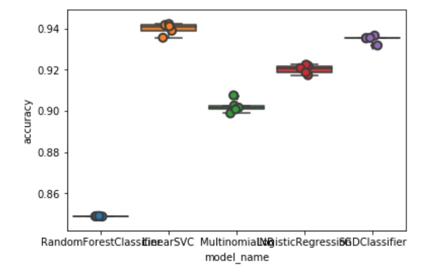
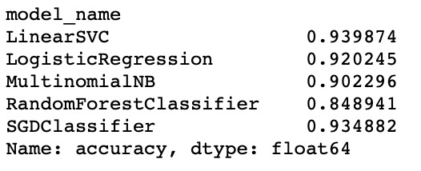

In the end, the total collection of models I've tried was really varied. It was a wide range from models based on decision trees to regression based models. I think having a wide selection of different models was a great way to see what worked and what didn't. 

Later on, I tried looking into neural networks. I wanted to try a convolutional neural network, since I read that these are very good at finding certain patterns, especially in images (they are based on how animals percieve images). This pattern recognition meant it should have worked great with natural language as well. Unfortunately, I could not get it to work in a reasonable amount of time, so I reverted back to a multi-layer perceptron; a neural network that was easy to implement (see training a model).

### Configuring a model

When configuring the models, I noticed that Random Forest Classifier for example had way worse results than other models. After looking into how this algorithm worked, I decided to change the depth of the tree so it would better reflect the amount of features and topics we had. This dramatically improved the performance of the model. You can see that the confusion matrix looks way better after tweaking the parameters.

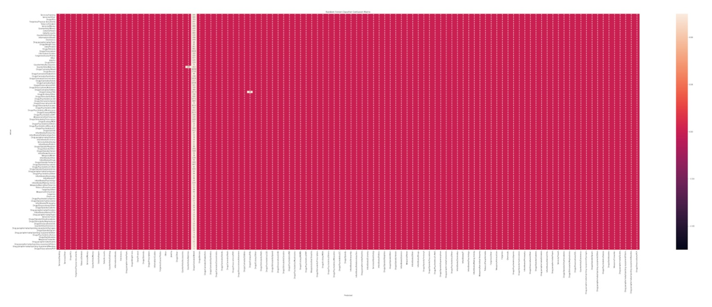

After we found out Linear SVC worked best, I tried tweaking the parameters and n-grams of tf-idf to try to get a higher score. Unfortunately, this did not work. The parameters appearently were already well tuned. In [notebook 8](./notebooks/Dennis_van_Oosten_7.1_ML_Comparisons.ipynb) I attempted to improve the best result of LinearSVC by tweaking the tf-idf vectorization.

### Training a model

In the following notebooks, I tried to get more insight in the learning process to maybe find a way to tweak and improve the best model so far (still LinearSVC with tf-idf vectorization). See [notebook 12.1](./notebooks/Dennis_van_Oosten_12.1_Learning_Curves.ipynb), [notebook 12.2](./notebooks/Dennis_van_Oosten_12.2_Learning_Curves.ipynb) and [notebook 13](./notebooks/Dennis_van_Oosten_13_Validation_Curves.ipynb). 

I also attempted to train a neural network (multi-layer perceptron). I did this with SKLearn which turned out to be a bad way to do it since it did not use the GPU. However, I did manage to train some models and the results weren't bad. However, they could not match LinearSVC on our dataset. See [notebook 18](./notebooks/Dennis_van_Oosten_18_CNN.ipynb), [notebook 19.1](./notebooks/Dennis_van_Oosten_19.1_MLP.ipynb), [notebook 19.2](./notebooks/Dennis_van_Oosten_19.2_MLP.ipynb) and [notebook 19.3](./notebooks/Dennis_van_Oosten_19.3_MLP.ipynb).
To compare how these neural networks compared to our best model, I trained our best model on different datasets in [notebook 21](./notebooks/Dennis_van_Oosten_21_Comparing_Best_Results.ipynb). 

When configuring the hyperparameters for the neural network, I had to deal with overfitting. Neural networks are known to overfit, and I noticed this while training. To prevent this I tweaked the hyperparameters. For example, I increased the learning rate or the alpha (punishment for the algorithm that basically adjustst the weight of the nodes) as countermeasures to prevent overfitting. I also tweaked the max_iterations so training would take less ong and the learning would just be stopped before the network overfitted.

### Evaluating a model & visualizing the outcome

I wanted to take a closer look into the comparison scores for different algorithms. In [notebook 7.1](./notebooks/Dennis_van_Oosten_7.1_ML_Comparisons.ipynb) I compare different algorithms against the entire dataset and in [notebook 7.2](./notebooks/Dennis_van_Oosten_7.2_ML_Comparisons.ipynb) I do the same with the dataset balanced to see if that made a difference. You can see an example of the scores of one of the models below:

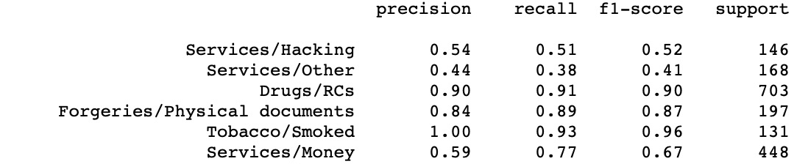
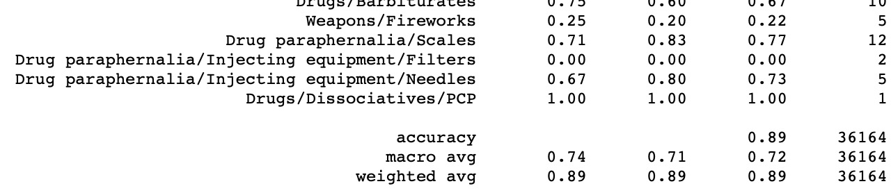

The following confusion matrices were also created in notebooks 7.1 and 7.2 (download to see the full image):
- [LinearSVC](./images/Confusion%20Matrix%20-%20Linear%20SVC.png)
- [Logistic regression](./images/Confusion%20Matrix%20-%20Logistic%20Regression.png)
- [Multinomial NB](./images/Confusion%20Matrix%20-%20Multinomial%20Naive%20Bais.png)
- [One vs rest](./images/Confusion%20Matrix%20-%20One%20Vs%20Rest.png)
- [Random forest](./images/Confusion%20Matrix%20-%20Random%20Forest%20Classifier.png)
- [SGD Classifier](./images/Confusion%20Matrix%20-%20SGD%20Classifier.png)
- [LinearSVC - Balanced](./images/Confusion%20Matrix%20Balanced%20-%20Linear%20SVC.png)
- [Logistic regression - Balanced](./images/Confusion%20Matrix%20Balanced%20-%20Logistic%20Regression.png)
- [Multinomial NB - Balanced](./images/Confusion%20Matrix%20Balanced%20-%20Multinomial%20Naive%20Bais.png)
- [One vs rest - Balanced](./images/Confusion%20Matrix%20Balanced%20-%20One%20Vs%20Rest.png)
- [Random forest - Balanced](./images/Confusion%20Matrix%20Balanced%20-%20Random%20Forest%20Classifier.png)
- [SGD Classifier - Balanced](./images/Confusion%20Matrix%20Balanced%20-%20SGD%20Classifier.png)

The confusion matrices show the correct and false predictions (true positive, true negative, false positive and false negative). A diagonal line is what we ideally want to see here. In some images, this line is more clear than in others.

## Domain knowledge

### Introduction of the subject field

The internet consists of two different sections, the clear- and the deep web. The deep web is the part of the internet which is not accessible through standard web browsers because it is not indexed and therefore not shown in the output of any search engine query. Within the deep web there is another part of the internet, the dark web, which has become the home for many traditional- or cybercriminals to sell goods or services because it is highly anonymized.

Law enforcement is very interested in this relatively unexplored part of the internet where criminals can seamingly do their business with low risk of getting caught. Therefore, Interpol has started a project called “Titanium”, which aims to get insight and knowledge about the dark web, targeted to help law enforcement track down criminals. 

The goal is also to pick up on things discussed on dark web forums, to detect newly discussed sellers or topics. To make this possible, a computer needs to be able to look at forum posts and item descriptions and determine what the topic is the given text is about. This way, when law enforcement is looking for a criminal selling a particular item, it is easy to see where that product is sold and on what forums it is discussed on.

The given text needs to be classified as one of the topics that Interpol is interested in. Since there are multiple topics, it is a multi-class text classification problem. To be able to make a classifier for the dark web, a pipeline needs to be created that can be fed with a text of varying length and predicts the topic of this text.

### Literature research

I have gathered a few papers during the course of the project that helped me better understand the field of knowledge. An example of a paper I looked at: [Complex Network Analysis of Darknet Black Market Forum Structure](./images/Thesis_Toms_Reksna.pdf)

### Explanation of terminology, jargon and definitions

The group decided that it was usefull to have a terminology list that consists of every term, jargon and definition that might not be clear. Another group member created [this list](./images/Terminology.pdf), which grew bigger during the course of the project.

## Data Preprocessing

### Data exploration & data visualization

To get a better understanding of how our data was structured, I tried visualizing it in [notebook 3](./notebooks/Dennis_van_Oosten_3_Data_Visualization.ipynb). Here, I visualised the categories, as well as the main categories. 

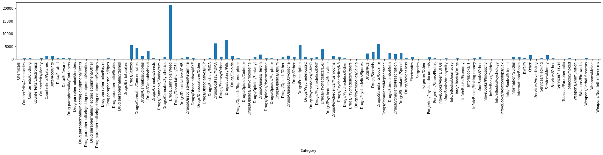
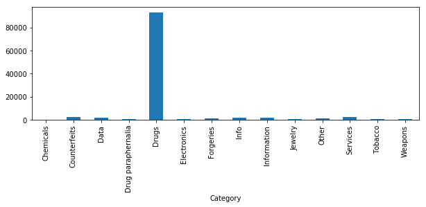

In the same notebook I also looked at what words are most correlated to each other for each category to see if that made sense. If a person can easily interpret the data ad categorize it, it should be doable for a machine learning model as well. If a human can't make anything of it, it is more unlikely a computer can.

Another group member visualised the length of the documents in the dataset. This gave us usefull information about the difference between the two datasets we had to work with. You can also see some outliers in the image below. For example, the Kaggle set has a few documents that are very long and should not be that long since the documents should be capped at 200 characters. When plotting the categories I could clearly see some outlier dots that indicated longer documents. Some syntax errors were probably made but these should easily be cleansed (see next section on data cleansing).

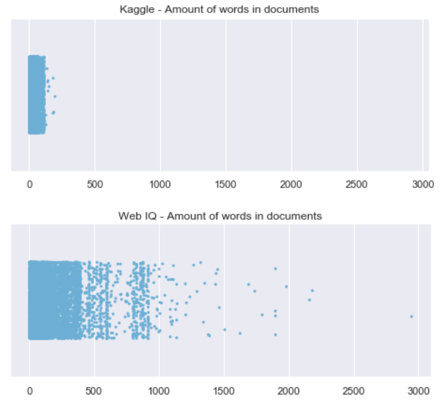

### Data cleansing & data preparation

As explained above, some outliers were found in the datasets. For example, Kaggle appeared to have some syntax errors which categorized some descriptions as categories (features as labels). I removed these from the dataset by clearing out categories that had only one description in them . These were probably not real categories but mistakes. I also cleaned out empty records because a model wouldn't be able to get any usefull information out of this. The reason I chose to delete items instead of, for example, taking the mean of similar items is because we were working with text data. Taking the mean would not really be possible or usefull. 

An example of the cleansing can most easily be found in [notebook 9](./notebooks/Dennis_van_Oosten_9_Creating_Reusable_DataFrames.ipynb). To be able to work more easily with the data and not having to cleanse it every single time, I created some standard, filtered and cleansed dataframes for the whole group to work with. The different dataframes I created are:
- All categories
- Main categories
- Balanced set (500 records per category)
- Balanced set with only main categories

The dataframes are all filled with raw data so we could preprocess them in the desired way. The [first notebook](./notebooks/Dennis_van_Oosten_1_Preprocessing.ipynb) shows the preprocessing script I created after trying out a lot of different methods. This script will help easily choose what preprocessing methods we want to use in the future of the project. In the script, I implemented a lot of the standard preprocessing methods that are widely used:
- Converting all characters to lowercase
- Removing punctuation
- Removing numebers
- Removing characters unique to unicode
- Removing stop words (from a standard list found in sklearn)
- Stemming (simple and fast, but created weird words)
- Lemmatizing (complex and slow because it uses a vocabulary, but gives more readable results)

I also implemented a step that could remove the last words from every description. This was necessary since we found out that one of the datasets cut off words when the document was longer han 200 characters. This left three dots and half a word at the end. The punctuation made sure the dots were left out, but half a word still remained that made no sense to incorporate into the corpus. 

Later on in the project, we thought we could still try to improve our model by balancing the data in a different way. The only balancing I'd tried so far was to remove entires from larger categories to make all categories of equal size and remove the ones that were too small. This worked, but meant that a lot of data was lost. In [notebook 26.1](./notebooks/Dennis_van_Oosten_26.1_Sample_Balancing_TFIDF.ipynb) and [notebook 26.2](./notebooks/Dennis_van_Oosten_26.2_Sample_Balancing_W2V.ipynb) I tried balancing by copying records from categories that had less records to make them all of equal length. This turned out to work well, but not better compared to the unbalanced set: [notebook 26.3](./notebooks/Dennis_van_Oosten_26.3_Main_Categories_W2V.ipynb). 

### Data explanation

The data used in the project comes from two different sources. The original idea from TNO was to work with a dataset they got from WebIQ, which consisted of item descriptions with varying length. However, due to privacy reasons, we were not allowed to work with that data at all in the beginning of the project and when we eventually were allowed to work with it, it was only possible on site at TNO or by working with the vectorized data. This made working with one of the two datasets really difficult. 

The other dataset however came from Kaggle and was publicly availabe. We spend most of the project on this set, especially the first half of the project. This dataset consisted of data from the Agora dark web marketplace. Just like the WebIQ one, it had item descriptions as features and categories as labels. 

Both datasets were labeled and quite similar with the big difference that Agora was large and thin (around 110,000 records which were cut off and therefore quite short) and WebIQ was short and fat (around 11,000 records of varying length, often longer that the Agora ones).

The group created a codebook for each of the datasets. Since this was not a lot of work, we decided to give this task to one person, meaning that I did not participate in this. However, the endresult was usefull for the whole group and can be seen in the images below.

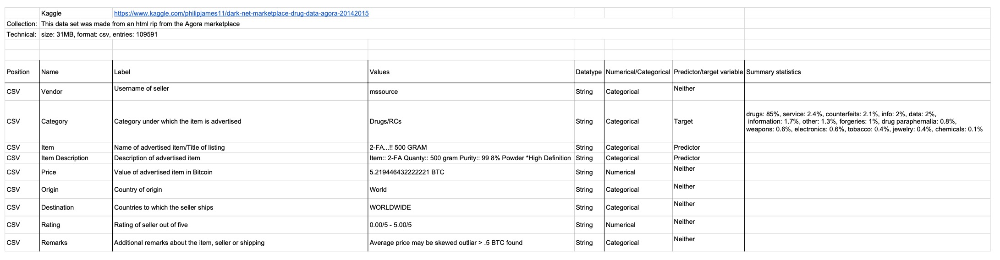
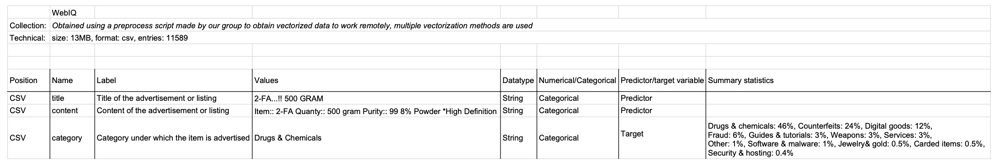

## Communication

### Presentations
During the project, I gave a sufficient amount of presentations. I don't know exactly how many, but every group memeber has roughly done the same amoutn of presentations, and definetely more than two. One of the presentations I'm proud of is one of the public ones I presented. The group made great progress in the weeks prior to this presentation and we had a lot to show. I made a big contribution to this as well. I created the differen dataframes and the confusion matrices shown of in that weeks presentation for example. The whole slideshow can be viewed  [here](./images/week_8_vrijdag.pdf). Images of some of the slides can be seen below.

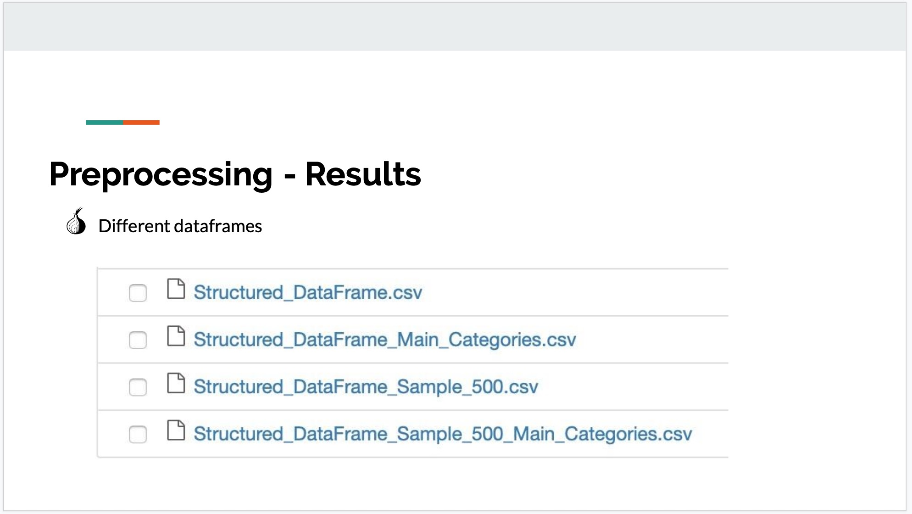
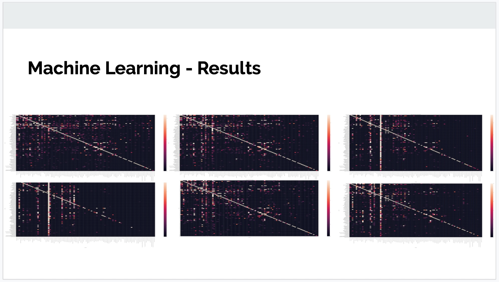
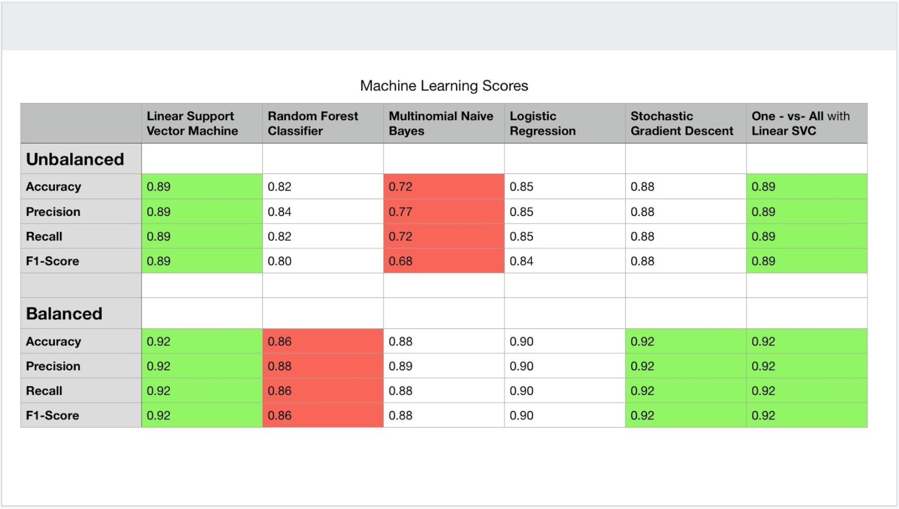

### Writing paper
The [paper](./images/TNO_Darkweb.pdf) was written using an online LaTeX editor (overleaf). The group as a whole wrote the paper together and all, including myself, contributed to the final outcome of the research. 

I was the first one to start writing after a base structure was created by another group member. I created a first draft of the introduction and started working on the data retrieval and methodology part. Also, I answered a few sub questions in seperate files, which did not make it to a great extend in the paper:
- [Structure of dark web markets](./images/Structure_of_Dark_Web_Markets.pdf)
- [Preprocessing methods](./images/Preprocessing_Methods.pdf)
- [Feature extraction methods](./images/Feature_Extraction_Methods.pdf)

Later on, the whole group basically contributed to almost every part of the paper, since we all went over it and changed bits everywhere. In the final paper, the intro is still largely written by me. I created part of the abstract and worked on a large part of the methodology. Specifically on the data retrieval, data visualization, pipeline, preprocessing, vectorization, model training and experiment setup. For the methodology section I also delivered the two category visualization images (see the first two images in data exploration and visualization) and I created the pipeline model from scratch:

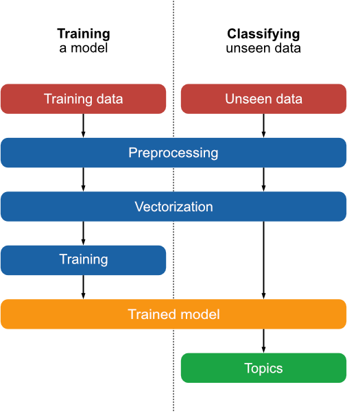

I also contributed to the results section (mostly the agora pipeline comparison and neural network section). In the discussion section I contributed a bit to the end of the first paragraph about mapping.

## Other notable contributions

### Validating on other dataset

To see if our pipeline of preprocessing, vectorization and training worked well in general, I tested it out with other datasets found on Kaggle. I compared the results from the Kaggle scoreboard to our results and they turned out quite well.
- The [IMDB reviews](./notebooks/Dennis_van_Oosten_15_IMDB_Reviews.ipynb) scored 90% while the best Kaggle score was 93%.
- The [Video game comments](./notebooks/Dennis_van_Oosten_16_Video_Game_Comments.ipynb) was off by 1.25 points while the Kaggle model was off by 1.22.
- The [Toxic comment](./notebooks/Dennis_van_Oosten_17_Toxic_Comment.ipynb) scored 92%.

Overall, we can say that our model performs pretty well on other datasets.

### Vectorization and t-SNE

To make a first attempt in vectorization I tried applying Bag of Words to our data. See [notebook 2](./notebooks/Dennis_van_Oosten_2_Bag_of_Words.ipynb). Later, I tried a different vectorization method: word2vec, and visualized the vector space using t-SNE. See [notebook 6](./notebooks/Dennis_van_Oosten_6_Word2Vec_&_t-SNE.ipynb). The t-SNE outcome was not a desired one, but at least it was a first attempt with some outcome. I probably did not feed the correct data into the model or I did not simply tweak the t-SNE parameters well enough. Luckily, another group member did manage to get some great t-SNE results.

### Improving scores

I tried a few more things in an attempt to improve the LinearSVC model, although with little success. See [notebook 10: One-vs-All Classifier](./notebooks/Dennis_van_Oosten_10_One_vs_All_Classifier.ipynb) and [notebook 11: K-means sentence clustering](./notebooks/Dennis_van_Oosten_11_K-Means_Sentence_Clustering.ipynb).

### Topic modelling and new data

Because TNO wanted the categories mapped to the Interpol topics list and maybe also detect new topics, I tried a form of topic modelling in [notebook 20](./notebooks/Dennis_van_Oosten_20_Extracting_Topics.ipynb). However, eventually we mapped the topics ourselves manually, since this wouldn't take that long and would assure that we got the best labels for further training.

To be able to combine the Agora data from Kaggle and the In [notebook 22](./notebooks/Dennis_van_Oosten_22_Mapped_Dataset.ipynb) I trained the mapped Agora dataset (this was already mapped by Wessel Ottevanger) to see how it would perform when labelled differently. In [notebook 23](./notebooks/Dennis_van_Oosten_23_Mapping.ipynb) Wessel and I mapped the 'darkweb markets dataset' (the new data from webIq that TNO wanted us to work on). We took a look at the categories in both datasets together to make sure the categories mapping made sense for both datasets. This was important, since training and classifying on categories with different descriptions in them that actually belong to a different category would not be great for the eventual result. In [notebook 24](./notebooks/Dennis_van_Oosten_24_New_Dataset.ipynb) I visualized and trained this new, mapped dataset to see how it compared to Agora.
