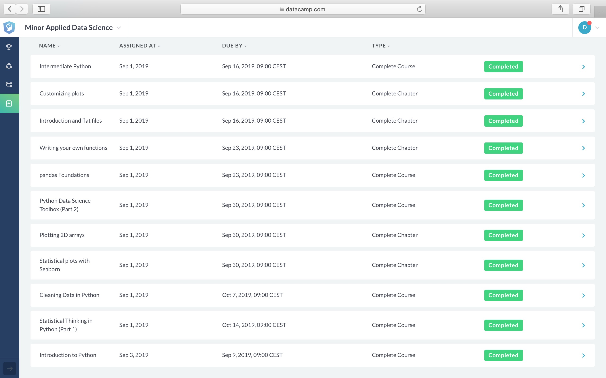
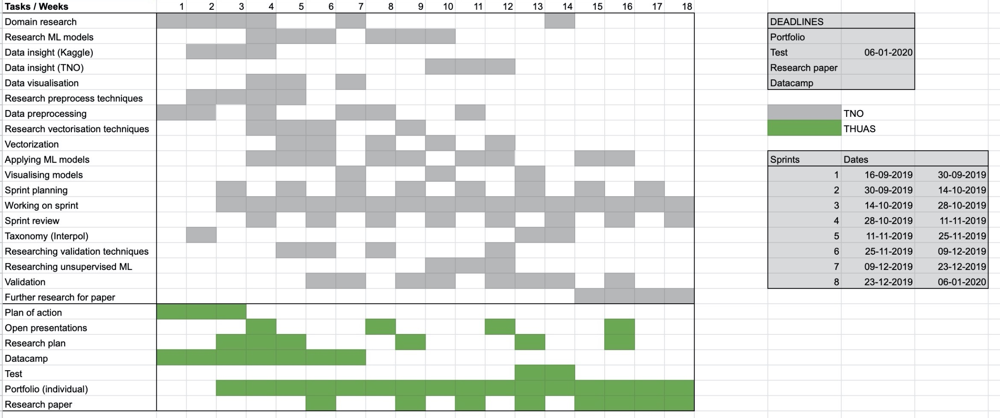
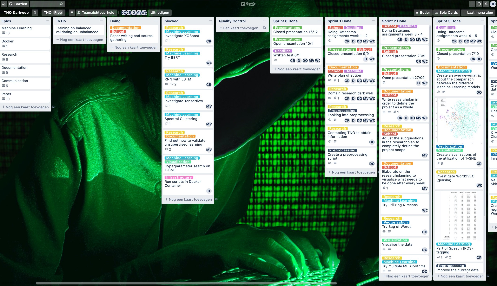

# Data Science Portfolio

## Datacamp course
I have completed the datacamp assignments required for this minor in time:

## Reflection and evaluation
- [Reflection on own contribution to the project](./reflection_and_evaluation/reflection_own_contribution.md) 
- [Reflection on own learning objectives](./reflection_and_evaluation/reflection_own_learning_objectives.md)
- [Evaluation on the group project as a whole](./reflection_and_evaluation/evaluation_group_project.md) 

## Research project

### Task definition
TNO is a Dutch research organisation that asked our group form The Hague University of Applied Sciences to collaborate with them on the TITANIUM project. This international project aims to reduce online crime by monitoring the dark web in a better way. One of the goals of the project was to monitor dark web markets and forums to automatically see what topics they are about. This is exactly what this minor project aims to solve. The task of the project is to create a multi-class text classifier that can take texts from dark web forums and markets and classify them to one of the topics on a list Interpol provides. The main research question was: “How can a pipeline be created that classifies dark web text based content to a predetermined list of topics?“. Using machine learning and natural language processing (NLP) the group used the course of this minor to create a complete pipeline to achieve this kind of classification.

### Evaluation
The desired result of this minor project was a pipeline that classifies dark web content to a topics list provided by Interpol. This goal was achieved, although I think not in a complete way. Due to the data that TNO provided, the classifier wasn't complete. By this, I mean that the model cannot categorize all topics interpol is interested in, simply because the data did not consist of all topics. The model could not be trained on topics with no training data. Nevertheless, I think I can say that the end result is a good pipeline that can classify the topics that were present in a sufficient way. The mapped topics scored a high accuracy and f1-score that TNO was happy with. 

For the future, I would suggest TNO or another research group continue the work our group did and use more data to be able to classify more topics.

### Conclusion
The result of the pipeline created by my group is a preprocessing script, a vectorization method and a model (linear SVC) that is trained with Agora and Web-IQ data to classify a range of dark web topics. The model scored around 95 percent for the mapped dataset on Agora. Looking at confusion matrices and f1-scores, the model also looked well. Considering the lack of some data, I think the end result is quite good. To answer the research question, the pipeline that we created looks as follows: Firstly, we preprocess the data using the preprocessing script created specifically for NLP. Then, we vectorize the data using tf-idf using n-grams. Lastly, new data is fed into the trained linear SVC model, which predicts the topic for the provided description.

### Planning
A general planning was made to determine which milestones the group had to make in order to stay on schedule. 

The project was planned using Agile SCRUM and this was done in Trello. Here, our two-week sprints, backlog and tasks were defined and the group used this to plan the project in order to determine what we would do and who would work on which tasks.

## Notebooks

The following provides a guide to the notebooks I've worked on during the minor. The guide will be (mostly) in chronological order, starting with the first steps into data science and working through multiple phases in the minor project. For more explanation of what I have done and what choices I made when choosing models and evaluating outcomes, please see the markdown comments in each of the notebooks that are linked in this file.

### Data Preprocessing

To practice with python and pandas, we got a dataset from TNO to practice on. This was a public dataset found on Kaggle and consisted of Agora marketplace data. The [first notebook](./notebooks/Dennis_van_Oosten_1_Preprocessing.ipynb) shows the preprocessing script I created after trying out a lot of different methods. This script will help easily choose what preprocessing methods we want to use in the future of the project.

### Vectorization and visualization

To make a first attempt in vectorization I tried applying Bag of Words to our data. See [notebook 2](./notebooks/Dennis_van_Oosten_2_Bag_of_Words.ipynb).

To get a better understanding of how our data was structured, I tried visualizing it in [notebook 3](./notebooks/Dennis_van_Oosten_3_Data_Visualization.ipynb).

Later, I tried a different vectorization method: word2vec, and visualized the vector space using t-SNE. See [notebook 6](./notebooks/Dennis_van_Oosten_6_Word2Vec_&_t-SNE.ipynb).

### Machine learning & Predictive Analysis

For the first attempt at training a model, I tried several on the dataset and compared the scores. See [notebook 4](./notebooks/Dennis_van_Oosten_4_Training_multiple_models.ipynb).

The best result from this initial attempt was a LinearSVC model. In [notebook 5](./notebooks/Dennis_van_Oosten_5_LinearSVC.ipynb) I took a more in-depth look into LinearSVC.

Later on, I wanted to take a closer look into the comparison scores for different algorithms. In [notebook 7.1](./notebooks/Dennis_van_Oosten_7.1_ML_Comparisons.ipynb). I compare different algorithms against the entire dataset and in [notebook 7.2](./notebooks/Dennis_van_Oosten_7.2_ML_Comparisons.ipynb) I do the same with the dataset balanced to see if that made a difference.

The following confusion matrices were created in notebooks 7.1 and 7.2 (download to see the full image):
- [LinearSVC](./images/Confusion%20Matrix%20-%20Linear%20SVC.png)
- [Logistic regression](./images/Confusion%20Matrix%20-%20Logistic%20Regression.png)
- [Multinomial NB](./images/Confusion%20Matrix%20-%20Multinomial%20Naive%20Bais.png)
- [One vs rest](./images/Confusion%20Matrix%20-%20One%20Vs%20Rest.png)
- [Random forest](./images/Confusion%20Matrix%20-%20Random%20Forest%20Classifier.png)
- [SGD Classifier](./images/Confusion%20Matrix%20-%20SGD%20Classifier.png)
- [LinearSVC - Balanced](./images/Confusion%20Matrix%20Balanced%20-%20Linear%20SVC.png)
- [Logistic regression - Balanced](./images/Confusion%20Matrix%20Balanced%20-%20Logistic%20Regression.png)
- [Multinomial NB - Balanced](./images/Confusion%20Matrix%20Balanced%20-%20Multinomial%20Naive%20Bais.png)
- [One vs rest - Balanced](./images/Confusion%20Matrix%20Balanced%20-%20One%20Vs%20Rest.png)
- [Random forest - Balanced](./images/Confusion%20Matrix%20Balanced%20-%20Random%20Forest%20Classifier.png)
- [SGD Classifier - Balanced](./images/Confusion%20Matrix%20Balanced%20-%20SGD%20Classifier.png)

In [notebook 8](./notebooks/Dennis_van_Oosten_7.1_ML_Comparisons.ipynb) I attempted to improve the best result of LinearSVC by tweaking the tf-idf vectorization.

### Creating reusable dataframes

To be able to work more easily, I created and saved a few different reusable dataframes where the Agora dataset was filtered in a few different ways. This way, we could easily choose which set we wanted to try out. In combination with the preprocessing script this gives the opportunity to switch between different combinations of preprocessing and balancing the data. The different dataframes created in [notebook 9](./notebooks/Dennis_van_Oosten_9_Creating_Reusable_DataFrames.ipynb) are:
- All categories
- Main categories
- Balanced set (500 records per category)
- Balanced set with only main categories

### More machine learning

After a while, a few more thing were tried in an attempt to imporve the LinearSVC model, although with little success. See [notebook 10: One-vs-All Classifier](./notebooks/Dennis_van_Oosten_10_One_vs_All_Classifier.ipynb) and [notebook 11: K-means sentence clustering](./notebooks/Dennis_van_Oosten_11_K-Means_Sentence_Clustering.ipynb).

### Visualizing learning process

In the following notebooks, I tried to get more insight in the learning process to maybe find a way to tweak and improve the best model so far (still LinearSVC with tf-idf vectorization). See [notebook 12.1](./notebooks/Dennis_van_Oosten_12.1_Learning_Curves.ipynb), [notebook 12.2](./notebooks/Dennis_van_Oosten_12.2_Learning_Curves.ipynb) and [notebook 13](./notebooks/Dennis_van_Oosten_13_Validation_Curves.ipynb).

### Validating on other dataset

To see if our pipeline of preprocessing, vectorization and training worked well in general, I tested it out with other datasets found on Kaggle. I compared the results from the Kaggle scoreboard to our results and they turned out quite well.
- The [IMDB reviews](./notebooks/Dennis_van_Oosten_15_IMDB_Reviews.ipynb) scored 90% while the best Kaggle score was 93%.
- The [Video game comments](./notebooks/Dennis_van_Oosten_16_Video_Game_Comments.ipynb) was off by 1.25 points while the Kaggle model was off by 1.22.
- The [Toxic comment](./notebooks/Dennis_van_Oosten_17_Toxic_Comment.ipynb) scored 92%.

Overall, we can say that our model performs pretty well on other datasets.

### Neural networks

I also attempted to train a neural network. I did this with SKLearn which turned out to be a bad way to do it since it did not use the GPU. However, I did manage to train some models and the results weren't bad. However, they could not match LinearSVC on our dataset. See [notebook 18](./notebooks/Dennis_van_Oosten_18_CNN.ipynb), [notebook 19.1](./notebooks/Dennis_van_Oosten_19.1_MLP.ipynb), [notebook 19.2](./notebooks/Dennis_van_Oosten_19.2_MLP.ipynb) and [notebook 19.3](./notebooks/Dennis_van_Oosten_19.3_MLP.ipynb).
To compare how these neural networks compared to our best model, I trained our best model on different datasets in [notebook 21](./notebooks/Dennis_van_Oosten_21_Comparing_Best_Results.ipynb).

### Topic modelling and new data

Because TNO wanted the categories mapped to the Interpol topics list and maybe also detect new topics, I tried a form of topic modelling in [notebook 20](./notebooks/Dennis_van_Oosten_20_Extracting_Topics.ipynb). However, eventually we mapped the topics ourselves manually, since this wouldn't take that long and would assure that we got the best labels for further training.

To be able to combine the Agora data from Kaggle and the In [notebook 22](./notebooks/Dennis_van_Oosten_22_Mapped_Dataset.ipynb) I trained the mapped Agora dataset (this was already mapped by Wessel Ottevanger) to see how it would perform when labelled differently. In [notebook 23](./notebooks/Dennis_van_Oosten_23_Mapping.ipynb) Wessel and I mapped the 'darkweb markets dataset' (the new data from webIq that TNO wanted us to work on). We took a look at the categories in both datasets together to make sure the categories mapping made sense for both datasets. This was important, since training and classifying on categories with different descriptions in them that actually belong to a different category would not be great for the eventual result. In [notebook 24](./notebooks/Dennis_van_Oosten_24_New_Dataset.ipynb) I visualized and trained this new, mapped dataset to see how it compared to Agora.

### Balancing differently

Another method we could still try to improve our model was to balance it in a different way. The only balancing I'd tried so far was to remove entires from larger categories to make all categories of equal size and remove the ones that were too small (see 'Creating reusable dataframes'). This worked, but meant that a lot of data was lost. In [notebook 26.1](./notebooks/Dennis_van_Oosten_26.1_Sample_Balancing_TFIDF.ipynb) and [notebook 26.2](./notebooks/Dennis_van_Oosten_26.2_Sample_Balancing_W2V.ipynb) I tried balancing by copying records from categories that had less records to make them all of equal length. This turned out to work well, but not better compared to the unbalanced set: [notebook 26.3](./notebooks/Dennis_van_Oosten_26.3_Main_Categories_W2V.ipynb). 

## Communication

### Presentations
During the project, I gave a sufficient amount of presentation. I don't know exactly how many, but every group memeber has roughly done the same amoutn of presentations, and definetely more than two.

### Writing paper
The paper was written using an online LaTeX editor. The group as a whole wrote the paper together and all, including myself, contributed to the final outcome of the research.
